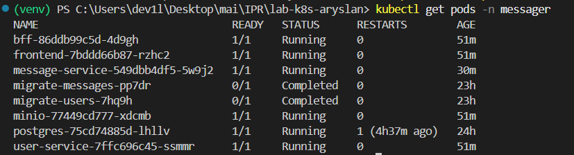
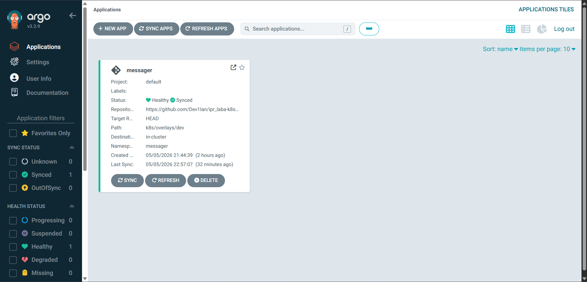
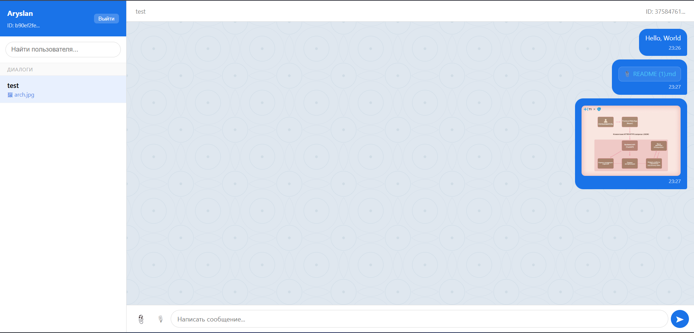
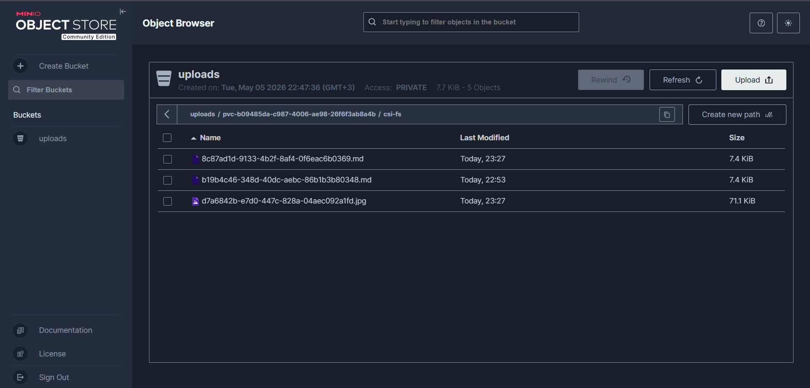

# Runbook

## Запуск

Если профиль minikube уже был создан с одной нодой, перед запуском нужно пересоздать кластер или добавить недостающие ноды.

```bash
minikube start --nodes 3

kubectl label node minikube workload=system --overwrite
kubectl label node minikube-m02 workload=app --overwrite
kubectl label node minikube-m03 workload=app disk=fast --overwrite

kubectl apply -k k8s/overlays/dev
```

Проверка:

```bash
kubectl get nodes --show-labels
kubectl get pods -n messager
```

Все pod должны быть Running/Completed.

---

## Доступ

Frontend:

```bash
minikube service frontend -n messager --url
```

---

## Проверка API

Цепочка:

frontend → bff → services

---

## Проверка S3 (файлы)

1. Открыть frontend
2. Отправить файл
3. Убедиться, что файл появился в MinIO (bucket `uploads`)

---

## Node Affinity

* postgres, minio → workload=system
* frontend, bff, user-service, message-service → workload=app
* message-service → disk=fast (preferred)

Для локального запуска используются 3 ноды minikube:

```bash
minikube     workload=system
minikube-m02 workload=app
minikube-m03 workload=app disk=fast
```

---

## ArgoCD

```bash
kubectl get app -n argocd
```

Ожидается:

```
Synced / Healthy
```


## Подтверждение работы

### Pods



### ArgoCD



### Frontend



### S3 (MinIO)


